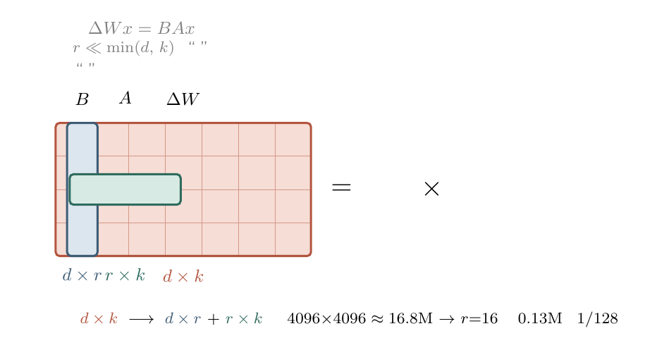

# 大模型微调浅谈

## 主流微调技术栈
- SFT：Supervised Fine-Tuning
    使用人工标注的数据进一步训练预训练模型，让模型能够更加精准地处理特定领域的任务。提到微调时通常指的都是有监督微调，还有无监督微调和自监督微调
- RLHF：Reinforcement Learning from Human Feedback
PPO是RLHF的经典实现
 - PPO: Proximal Policy Optimization
    通过点赞、点踩等**奖励信号**来渐进式调整模型的行为策略，上限较高但实现复杂
DPO是一种绕过RLHF的替代路线
 - DPO：Direct Preference Optimization
    通过人类的对比选择来直接优化生成模型，简单稳定，但受数据质量影响较大
- RAG：Retrieval-Augmented Generation
    RAG会将外部信息检索与文本生成相结合，在生成答案时实时获取外部信息和最新信息，但它并不改变模型权重，严格来说不属于微调，常被拿来和微调做选型对比
简而言之数据充足选微调，数据少且动态更新选RAG，RAG检索耗时可能会较长，实际工程中二者也可以动态结合

### SFT
可分为全参数微调和部分参数微调两大类
#### Full Fine-Tuning

对整个pre-train model进行微调，会更新所有参数，通常能够获得最佳性能，但需要的算力资源较大，且易过拟合

#### Partial Fine-Tuning

只更新模型的部分参数，过拟合风险低，能够以较小的代价取得较好结果，但一般无法得到最优性能
##### LoRA：Low-Rank Adaptation of Large Language Models
LoRA的核心思想是对矩阵进行低秩分解，什么是低秩分解呢，简单地说就是一个”胖”矩阵可以分解成两个”瘦”矩阵的乘积

如果用$h$表示模型输出，我们可以写出下式：

$$
h=W_{0}x+\Delta W \cdot x=W_{0}x+BAx
$$

其中$W_0 \in \mathbb{R}^{d \times k}$表示预训练模型的原始权重（训练时冻结），$x \in \mathbb{R}^{k}$代表模型输入，$\Delta W$代表微调引起的权重变化量（与$W_0$同形状），$BA$就是我们对$\Delta W$做的低秩近似：$B \in \mathbb{R}^{d \times r}$、$A \in \mathbb{R}^{r \times k}$，其中秩$r \ll \min(d, k)$。训练开始时$B$初始化为零矩阵、$A$随机初始化，这样保证起点行为与原模型完全一致，再逐步学出增量

对比不难看出，LoRA的精髓就是在保持$BA \approx \Delta W$的前提下让$BA$储存的数据量远远小于$\Delta W$：参数量从$d \times k$降到$r \times (d+k)$。具体操作时会先冻结预训练权重，训练得到结果后可直接挂载adapter开始推理，也可进行权重合并消除额外延迟
LoRA有一系列非常好的特性：
- No Additional Inference Latency
    若将低秩矩阵合并回原权重（$W = W_0 + BA$），推理时的计算开销与微调前完全一致——低秩结构只改变权重数值，不增加任何计算步骤。而挂载adapter推理（不合并）的形态下会有两次小矩阵乘的额外开销，但换来的是即插即用：更换$B$和$A$就可以在一个特定领域上快速切换模型行为
- 训练显存开销骤降
    优化器状态和梯度只需要为可训练的$B$、$A$准备，而不是全部参数。以一个7B模型、$r=16$为例，可训练参数往往只占全模型的百分之一以下，配合4bit量化底座（QLoRA）甚至可以把消费级8G显卡拉进战场
- 检查点极小，便于分发与版本管理
    保存的只有$B$和$A$，体积通常是原模型的百分之一以下（一个6.4B模型的LoRA权重约300MB），共享一个"底座+多个领域adapter"的组合远比每个领域存一份全量模型划算
- 底座冻结，灾难性遗忘更轻
    预训练权重原封不动，模型原有的通用能力不会被新任务的梯度冲掉，对多任务叠加和持续学习场景都比较友好
对新手比较友好的微调框架是Llama-Factory，支持0代码微调，微调大手子也可以看看transformers.Trainer和DeepSpeed

接下来以Llama-Factory为例，简述一下大模型微调全流程：
- 准备硬件资源
    消费级显卡的显存资源通常较为逼仄，一般都需要在主流的GPU租用平台上（如AutoDL、[优云智算](https://passport.compshare.cn/register?referral_code=LafRLI9LtB1F2y6OF3AzyR)等）租用大显存的计算卡，按量计费。成本相对可接受。同时在起实例的时候可以直接把需要用到的镜像配置好
- SSH远程连接和Llama-Factory环境配置
    一般云GPU厂商都会提供ssh密钥和对应的密码，我们需要copy下来才能在自己的电脑上远程控制云端实例，连接上实例之后就可以按照Llama-Factory的readme开始配环境了，当然，在今天这一切都可以交给agent去做。
- 下载基座模型，开始微调
    Huggingface是全球最大的模型托管平台，托管了很多优秀的基座模型，可以按需下载进行本地部署或微调。我们可以在Llama-Factory的可视化界面上加载模型，如果加载成功，则可顺利进入后续工作
- 挂载用于训练的数据集，设置合适超参，开始微调
    微调精髓在于客制化的数据集，通常我们要把自己准备的语料存成一个.json文件，.json文件里要按照instruction-input-output的格式把问题和答案都准备好
    最后一步是设置合理的超参，超参数是一批我们人为预先指定好的数字，合理地设定超参可以充分利用计算资源，榨干显卡，同时也可以避免模型陷入局部最优和（欠）过拟合等，常用的超参如下：
    - 学习率（Learning Rate）：决定了模型每次更新时权重改变的幅度，过大会错过最优解，过小则有可能收敛过慢或陷入局部极小
    - 训练轮数（Epochs）：训练轮数过低会导致欠拟合，过高则会过拟合
    - 最大梯度范数（Max Gradient Norm）：梯度超过这个值会自动截断，避免梯度爆炸
    - 最大样本数（Max Samples）：每轮训练中最多使用的样本数
    - 计算类型（Computation Type）：在训练时选用的数据精度，通常bf16和fp32效果相差不大，精度越高需要的显存开销越大，需要在二者之间作出权衡
    - 截断长度（Truncation Length）：处理长文本时超过该阈值将被截断，避免内存溢出
    - 批处理大小（Batch Size）：由于内存限制，我们需要分批发送训练集数据
    - 验证集比例（Validation Set Proportion）：数据集通常会分为训练集和验证集两个部分，前者用来训练，后者负责验证学习效果
    - 学习率调节器（Learning Rate Scheduler）：在训练过程中自动调优学习率
    如若loss曲线降低太慢可尝试增大学习率，如若训练结束loss还呈下降趋势，可增大轮数确保能够拟合
- 评估微调效果并导出合并后的模型
    在微调过程中通常会定期保存检查点，每2000step或每1000step保存一次，对LoRA而言，检查点包含了训练得到的B和A这两个低秩矩阵的权重，微调结束后通常会将检查点中的LoRA权重和基模本身权重合并，融合得到最终的新模型（也可以保留adapter形态即插即用）