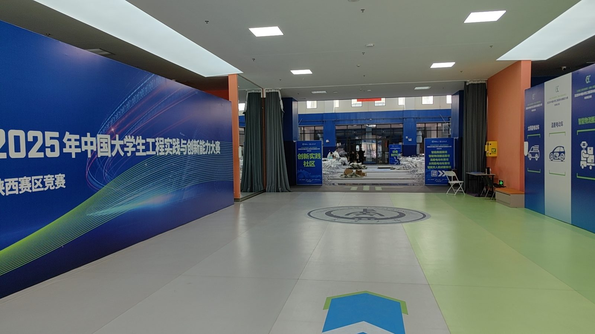
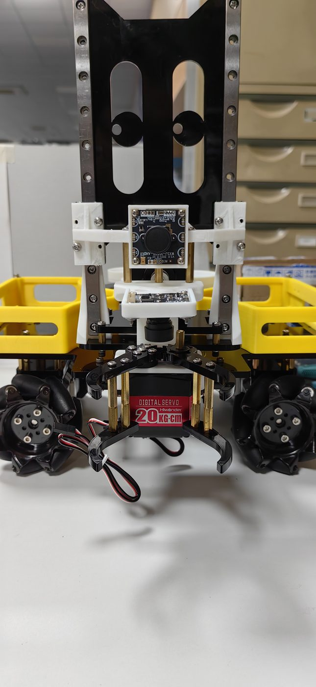
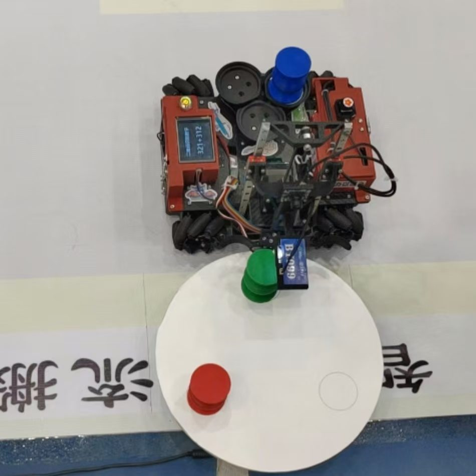

# 智能物流搬运：电控侧的车、环与发车

> 🪪 **Human in the loop** — 本文使用了生成式 AI 工具，并由作者 review。

*2025.10*

Human in the loop · 2025.10

2025 年中国大学生工程实践与创新能力大赛，陕西赛区，智能物流搬运。我在队里做电控。成绩是一等奖，全省第三，进入决赛。

## 场地在说什么

决赛场地的通道墙上写着三项赛道：太阳能电动车、温差电动车、智能物流搬运。我们走的是第三条。地面有大赛标识，大厅里摆着观众席——这不是实验室里的一次调试，是要在限定场地上把物料搬走的比赛。

）

## 两代车体

备赛中的原型机把结构摊开给人看：四麦克纳姆轮、前方夹爪、夹爪上方摄像头、两侧黄料盒、中间一块带椭圆开孔的立板。夹爪由一颗标着 Hiwonder 20kg·cm 的数字舵机驱动。这版车的任务很清楚——全向走、看见物块、夹起来、放进料盒。

）

省赛夹取实况里的车已经换了一层皮：红框、顶面屏幕打着 `321 + 312`、中部是黑色三角架/起升结构，正在从白色转盘上夹绿色柱体。转盘上还有红色柱体和空位，地板上能读到「智」「流」残字。同一项任务，车体从「前伸夹爪」走到了「转盘边的起升机构」——这是迭代，不是同一张照片的两个角度。

）

## 电控怎么分层

我负责电控。下位机主控是 `STM32F103ZET6`，上位机是树莓派 4B，发车走 ESP32 无线。可以确定的职责切分是：STM32 贴着电机与传感器，树莓派在上面做需要更大算力的那一层，ESP32 把「开始跑」从有线按钮里解放出来。

麦克纳姆轮要的是全向速度合成；物流搬运要的是走、停、对准、夹、放。角度环是底盘能不能听话的第一道门——环散了，后面的任务规划没有意义。

> 待补：待 review 补一句：树莓派上具体跑的视觉/决策程序；STM32 上角度环、速度环、位置环如何分层；PID 的 Kp/Ki/Kd 与采样周期。

## 角度环的两次失败

调 PID 时我录了两段。第一段：参数给错，给定姿态后角度发散，车在原地把误差越积越大。这是比例/积分把系统推过稳定边界的典型样子——不是「差一点」，是环已经不是环了。

第二段：环能回正，但回得慢。车最终朝向目标，过程拖沓。比赛里「能稳住」不够，转盘不会等你慢慢拧回来。发散是稳定性问题，回正过慢是性能问题，两段录像把这两件事分开了。

> 待补：待 review 补一句：从发散到可用，中间改过哪些增益；是否先调 P 再补 I/D。

## 无线发车，跑完全程

ESP32 把发车做成无线之后，车可以在赛场上听指令起步，并在一次测试里跑完全程。这不是奖状上的句子，是一条可以回看的轨迹：底盘稳了，任务序列才接得上。

> 待补：待 review 补一句：夹爪从原型前伸舵机爪改到决赛起升机构的机械原因；无线协议与抗干扰。

## 结果

陕西赛区一等奖，全省第三，进入决赛。这篇只写电控侧我确定的事实：分层、两次失败的角度环、一次跑通的无线发车。机械迭代和视觉细节，等我补完再写进同一条回路里。
