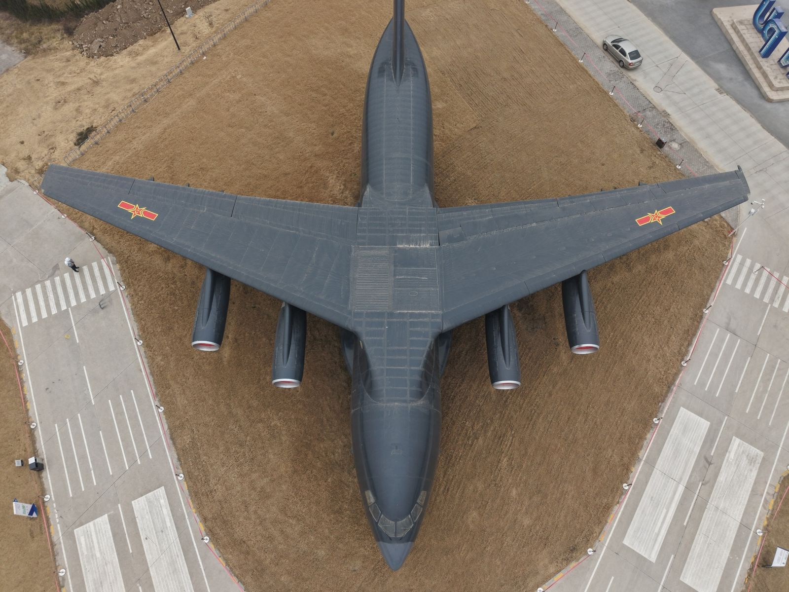

# 高斯泼溅二三事

## Round 0
记不大清楚最开始是怎么注意到$Gaussian Splatting$的了，似乎是影视飓风出了一期讲$NeRF$的视频， 后续又刷到大队长优化指南的视频，当时只觉得这两个方法重建出来的效果非常$fancy$，后面照着知乎跑了一个$NeRF$的例程，便没怎么再关注过了。
## Round 1
大三寒假准备把学校南边的飞机坪搬到$UE$里，做一个航空知识科普的小软件（~~实则是标准的$Shit$ $Hill$~~），当时考虑还是应该尽可能保真地把实景重建出来，于是自然而然地想尝试一下高斯泼溅。

对于当时的$case$，其实只需要猛拍素材就可以~~Dirty Work 警告~~，飞机坪上一共有13架飞机，于是集资租了一架DJI Air3S来（70CNY per Day），一共拍了三天，整个采数据的$Bottle Neck$在于三块电池只能飞一个半小时，而充满需要3个小时，所以只能早上一趟，下午一趟（有一天飞了三趟），最后大概干了8000张飞机照片，最后重建效果还可以，只有$ARJ21$机翼素材拍的不够，最后重建出来缺了一块
### Interlude
不得不吐槽一下$NPU$的$Bureaucratism$，第一天去拍的时候刚飞一会就被保安大爷拦了，说需要向保卫处报备云云，遂致电保卫处了解具体操作流程，说需要写一份情况说明，按要求写好并盖章后再次致电，结果被告知**保卫处不管这件事**，说实话当时有点无言以对，挂掉电话之后直接去飞机坪开拍，不出意外这次还是被拦住了，仍然是说需要向保卫处报备，掏出有章的情况说明后保安师傅拍照留存，以情况说明没有写时间为由还是不让飞无人机，找xy老师补写时间之后拍给保卫处y师傅，终于能飞无人机了
### Follow-up
当时租Air3S主要考虑到它有两颗镜头，一颗24mm广角镜头，一颗70mm长焦镜头，用广角镜头尽可能覆盖全面地拍摄，用长焦镜头补拍细节
>实际上mini5 pro就完全够用，高斯泼溅在原始素材上追求的是尽可能多的视角，使用长焦拍摄反而会增大$Colmap$解算位姿的难度

每天在飞机坪一动不动地站三个小时，终于把素材拍完了，之前一直没飞过无人机，感觉具体过程其实还算挺有趣的，消费级无人机如果续航和充电速度能再提一提就更舒服了。
当然，保卫处的师傅还是每天都要来盘问一次（~~每天都是同一个人，话说真的对我没印象嘛~~），拍轰6底部有好几次可能是因为飞的太低，飞控好像会直接判成已着陆，好几次自己降落不飞了，我只好走进去把飞机捡回来，然后又被刚好带着小孩经过此地的老师盘问了，忙不迭出示情况说明（算是我当时的丹书铁券？$Maybe$），好在没被找事。当然我并不是一个很斤斤计较的人，只是不忿于明显的区别对待，彼时彼刻某个课题组的师生也在飞机坪飞自己组的六旋翼无人机，然而保卫处看有老师跟着便任其信马由缰，着实令我大开眼界。

>找找我在哪里~
## Round 2
下一步需要对拍摄的素材进行后处理，尽可能高质量地重建出高斯点云来。$Splatting$这个概念早在1990年前后就被提出，1990-2000可以看作是高斯泼溅的萌芽期，更多是把$Splatting$作为渲染的一个切口，使用高斯核来解决渲染时的$aliasing$。或许是受限于硬件算力，当时似乎并没有太多目光聚焦在这一方向，直到2020年$NeRF$的横空出世，人们第一次大规模地验证了可微渲染器+多视角图像监督可以$End2End$优化出一个完整的3D场景表示，在当时，$NeRF$的效果可谓是相当惊艳，不过整个$Training$还是耗时过久，学术界和工业界当时都在尽己所能地寻找更快更真实的渲染方式，直到2023年8月8日，$arXiv$上兀地出现了一篇雄文：$3D$ $Gaussian$ $Splatting$ $for$ $Real-Time$ $Radiance$ $Field$ $Rendering$，三年的探索之路或许颇为曲折，但属于3D高斯泼溅的绚丽时代就此徐徐展开。
>什么是可微渲染器？什么是多视角图像监督？什么又是端到端？等我填坑

$FastLab$主理人，著名学者Fei.G将所有技术范式统归为3个阶段：**科学发散**——**技术收敛**——**工程落地**。在3D高斯泼溅比较完美地实现了技术收敛后，以各类傻瓜式重建软件为代表的工程落地时期迅速到来，这些软件也成为了我重建工作流的重要组成部分。

| 
重建方案
   | 
知天下
                           | 
Postshot
     | 
MipMap
             | 
BSD
                          | 
PointCom
                    | Lichtfeld Studio                       |
| ----------------------- | ---------------------------------------------- | ----------------------------- | ----------------------------------- | --------------------------------------------- | -------------------------------------------- | -------------------------------------- |
| 
**特点**
 | 国内高斯泼溅生态的培育者，始终如一地提供免费重建服务，作为一家初创公司，和创作者联系尤其紧密 | 国际首个高斯泼溅重建软件，内测时期免费，正式发版后开始收费 | 更加专业的高斯泼溅重建体验，可以使用教育邮箱申请一个月的试用，体验不错 | 来自武汉的初创团队，每月发版一次供大家免费试用，重建效果极佳，是大部分民间高斯艺术家的首选 | 来自西安的初创团队，以重建出的点云无伪影而闻名业界，一张素材0.02rmb，重建效果不错 | 国外开源免费的3D高斯重建软件，效果极佳且支持参数自定义，获得海内外一致好评 |
在当时基于航拍素材进行点云重建时，我并不知道谁家的方案最优，基本上把上表提及的所有方案都试了一遍，知天下免费，但当时只支持导出sog格式的文件；Postshot效果不错，但一月20美金，还是往后稍稍；MipMap可以给到一个顶级，可以拿教育邮箱开一个月的专业版使用，我记得还支持数据空地融合，最后还会生成一个重建报告，整个体验还不错；PointCom也可以给一个顶级，重建效果方面没的说，同时和我对接的客服态度也非常好，整个体验也非常好；BSD和Lichtfeld Studio可以给到夯，免费且效果极佳，最终实际使用的点云是借助Lichtfeld Studio重建出来的，感谢$MrNeRF$！
在使用成熟的重建软件之外，我同样还尝试了直接运行各大魔改的高斯源码，在优云智算和AutoDL上开了几个虚拟机，主要试了一下gsplat和Difx3D+，总共加起来烧了1K+，Difx3D+是把Diffusion Model和高斯泼溅结合了一下，看上去效果非常的美妙，不过只支持一种焦距，在我3种焦距的素材上跑成了一坨shit（单一个Difx3D+烧了700+）
## Ending
最终的结局还算可以，重建出来了一个相对可用的点云，认识了知天下的老大Kuan.S、Beluga等一众对高斯泼溅充满激情的神豪，对我个人而言也算对高斯泼溅进行了一次管中窥豹的尝试，这感觉还算不错吧，虽然干的主要是$Dirty$ $Work$，希望以后有机会尝试一些算法侧的东西。
## Appendix
最后附上托管在知天下的展机点云合集：[西北工业大学展机](https://3d.explorerglobal.cn/collection/web/5vxjmwx8)